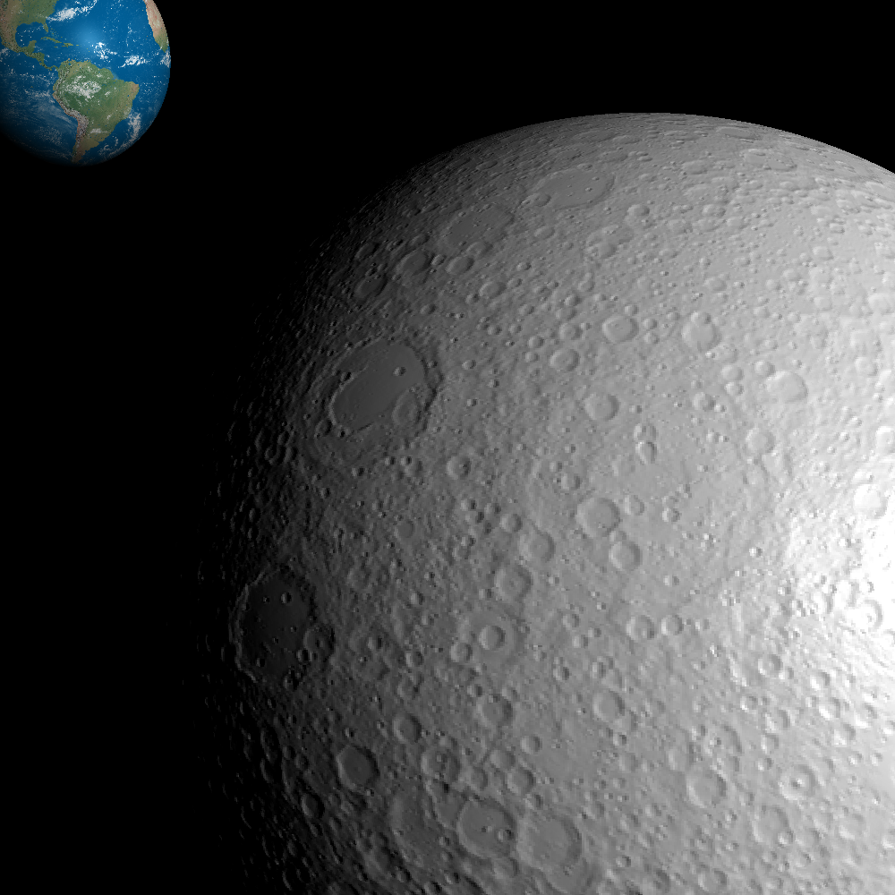
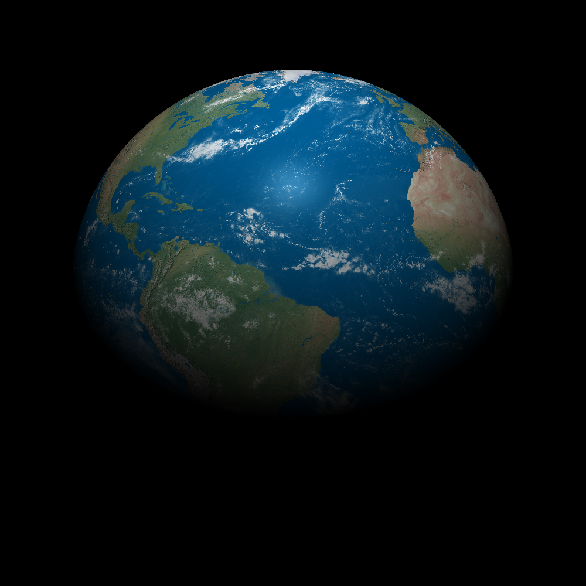
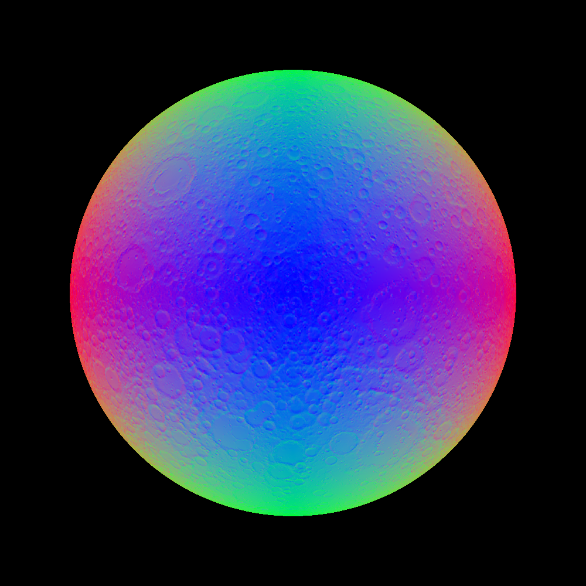
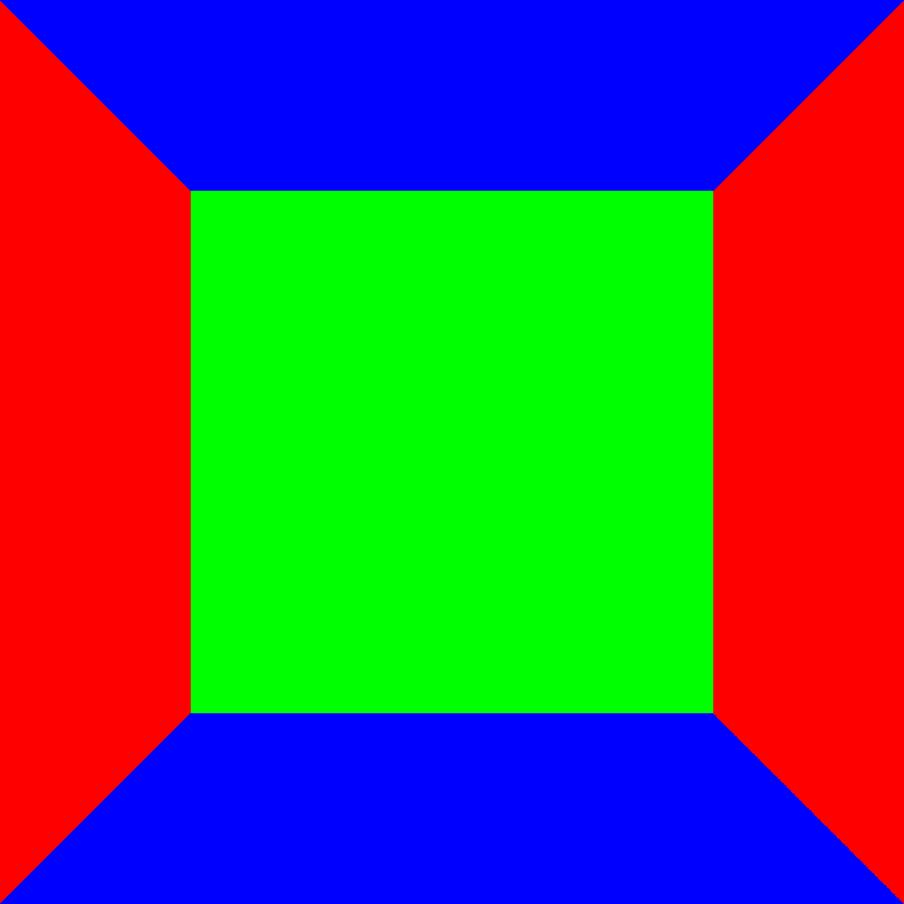

## Ray Caster

A ray casting project I made.  

# Rendered Images

### Credit

This is an assignment from MIT's [6.837 OCW](https://ocw.mit.edu/courses/6-837-computer-graphics-fall-2012/) computer graphics course.  

